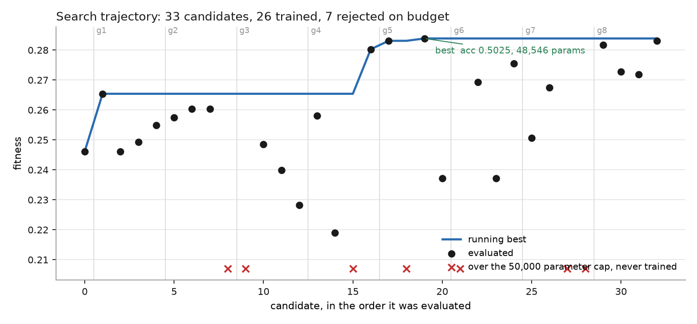
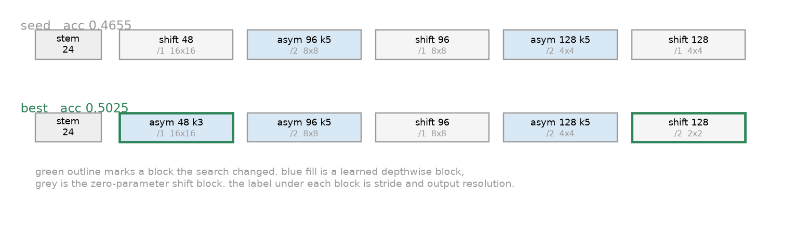
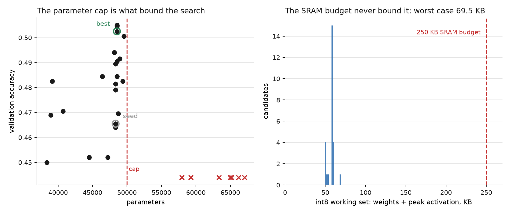
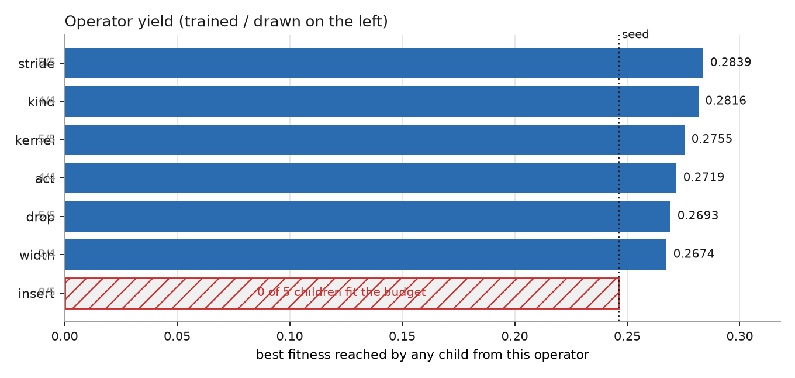

# ENAS for microcontrollers

**Evolutionary architecture search under a hard 50,000 parameter budget, with
the failed candidates and the search's own defects in the log.**

[](https://github.com/aghasalim/enas-microcontroller/actions/workflows/ci.yml)
[](LICENSE)

A hand-written baseline for a Cortex-M class device is mutated one edit at a
time, each child is trained briefly on CIFAR-10, and anything that would not fit
the device budget is rejected before a gradient step is spent on it. The search
improved the baseline by 3.7 accuracy points at equal footprint. It also selected
on the test split, ran one training seed, and evaluated on 2,000 images, and
those three facts are large enough that most of this document is about them.

All 33 candidates, including the 7 rejected and the 4 evaluated twice, are in
[`results/search_log.csv`](results/search_log.csv). Every number and figure below
is derived from that file, and [`check_numbers.py`](check_numbers.py) fails the
build if the two disagree.

## 1. Objective

Let $m$ be an architecture, $\mathrm{Acc}(m)$ its validation accuracy,
$P(m)$ its parameter count, $M(m)$ its multiply-accumulates for one 32x32 input,
and $A(m)$ the largest single activation tensor any layer produces. The search
maximises

$$\mathcal{F}(m) = \mathrm{Acc}(m) - \beta \log_{10} P(m) - \gamma \log_{10} M(m),
\qquad \beta = \gamma = 0.02$$

subject to two constraints that are enforced as rejections rather than penalties:

$$P(m) \le 50{,}000 \qquad\text{and}\qquad P(m) + A(m) \le 250\text{ KB at int8}$$

A model that breaches either cannot be flashed at all, so it scores
$-\infty$ instead of a good accuracy with a deduction. Soft penalties let an
undeployable model win whenever its accuracy advantage exceeds the deduction,
which measures the wrong thing. The rejection also runs before training, so an
infeasible candidate costs no compute.

$A(m)$ is measured with forward hooks as the largest tensor any module emits, not
estimated from $P(m)$. Weights are the number people quote; activations are the
number that makes the deployment fail. A real arena allocator does better by
reusing buffers, so this is an upper bound on the working set.

## 2. Search space

A genome is a dict, not generated code:

```python
{"stem_width": 24, "act_shift": 4,
 "blocks": [{"kind": "shift", "out": 48, "stride": 1, "k": 3}, ...]}
```

so every mutation is an edit that can be logged, diffed and replayed, and every
architecture in the run is reconstructible from its genome alone. Replaying the
33 logged mutations reproduces
[`results/best_genome.json`](results/best_genome.json) exactly, which is a test.

Seven operators, one edit per child so a fitness change has one cause:

| operator | edit |
| --- | --- |
| `width` | output channels of one block, from {16, 24, 32, 48, 64, 96, 128, 160} |
| `kernel` | depthwise kernel of one block, from {3, 5, 7} |
| `kind` | flip one block between `shift` and `asym` |
| `act` | activation leak exponent, from {2, 3, 4, 5} |
| `insert` | add a block after position i |
| `drop` | remove block i |
| `stride` | flip one block between stride 1 and 2, capped at 3 downsamples |

`kernel` only targets `asym` blocks. Shift blocks carry no spatial weights, so
offering them a kernel edit produces a model identical to its parent and burns a
training slot. Both block types are chosen for what they cost on the device:

- **`shift`** replaces the spatial half of a convolution with `torch.roll` over
  five channel groups, following Wu et al. (2018). No weights, no multiplies, and
  on the device it is pointer arithmetic.
- **`asym`** buys a $k \times k$ depthwise receptive field as $1 \times k$ then
  $k \times 1$, the factorisation from Szegedy et al. (2016) applied to the
  depthwise convolutions of Howard et al. (2017). Ten weights per channel instead
  of 25 at $k = 5$, and the intermediate never materialises at full width, which
  matters more for peak SRAM than the weight saving does.

The activation is a ReLU6 with a leak of $2^{-s}$. In an int8 pipeline that
constant is an arithmetic right shift rather than a multiply, and the clamp keeps
the output range fixed so the activation folds into requantisation.

## 3. Protocol

| | |
| --- | --- |
| dataset | CIFAR-10, 8,000 training images (16% of the split), 2,000 validation |
| **validation source** | **the official test split, see section 6** |
| epochs per candidate | 3 |
| optimiser | AdamW, lr 3e-3, weight decay 5e-4 (Loshchilov and Hutter, 2019) |
| schedule | OneCycle over all steps (Smith and Topin, 2019), gradient clip 1.0 |
| augmentation | random crop 32 with padding 4, random horizontal flip |
| batch size | 128 train, 256 eval |
| **training seeds** | **1, fixed at 0 for every candidate, see section 6** |
| search | 8 generations, 4 children, hill climb on best-so-far |
| hardware | Apple M4, CPU only, 4 threads, torch 2.13.0 |
| wall clock | 65 minutes of training over 33 candidates |

The seed is set before the model is constructed, not after, which is what puts
weight initialisation inside the seed. Four genomes were evaluated twice during
the run and all four returned byte-identical accuracy, which is the evidence that
this holds.

## 4. Result

| | accuracy | parameters | MACs | peak activation | fitness |
| --- | ---: | ---: | ---: | ---: | ---: |
| seed, hand written | 0.4655 | 48,354 | 1,920,768 | 12,288 | 0.2461 |
| **best found** | **0.5025** | 48,546 | **1,761,024** | 12,288 | **0.2839** |

3.7 accuracy points and 8.3% fewer multiply-accumulates for 192 more
parameters, found at generation 5, candidate 2.

**Read 0.5025 as a ranking score, not an accuracy.** Three epochs on 16% of the
training set at under 50,000 parameters is a budget chosen to make a 33 candidate
search cost an hour instead of a week. It is enough to order architectures and
nowhere near enough to say what one is worth. The winner has not been retrained,
so this repository states no headline accuracy.



## 5. What changed, and what the ablations support



Two edits separate the winner from the baseline: block 0 became a learned
asymmetric depthwise block instead of a zero-parameter shift block, and block 4
gained a stride. The path was not two steps. Block 3's stride went 2 to 1 in
generation 1, the first improvement found, then back to 2 in generation 5, the
last. Four generations were spent on a change that was undone.

**Learned spatial filtering pays at high resolution and not at low.** Both
conversions below were drawn from the same parent in the same generation, so this
is a controlled pair rather than two anecdotes:

| edit | position | resolution | accuracy | change |
| --- | --- | --- | ---: | ---: |
| `kind block0 shift->asym` | first block | 16x16 | 0.5045 | +0.0150 |
| `kind block4 shift->asym` | last block | 4x4 | 0.4825 | -0.0070 |

Parent accuracy 0.4895. The last-block conversion was drawn again in generation 8
from a stronger parent and lost again (0.5005 against 0.5025), so the direction
held twice. Both changes are within the noise band quantified in section 6.

**The gain is from having learned filters early, not from a larger receptive
field.** Once block 0 was learned, widening its kernel from 3 to 7 in generation 7
dropped accuracy from 0.5025 to 0.4695.

**The activation default survived but was not swept cleanly.** Against the
generation 1 parent the default $2^{-4}$ beat $2^{-2}$ (0.4640) and $2^{-5}$
(0.4815), and against the final parent it beat $2^{-5}$ again (0.4905 against
0.5025). But $2^{-3}$ was only ever tried against the seed, the weakest parent in
the run, where it won (0.4790 against 0.4655). $2^{-3}$ is untested on any strong
topology.

**The parameter cap bound the search; the SRAM budget never did.**



All 7 rejections were the parameter cap. No candidate came near the 250 KB SRAM
budget: the worst working set observed was 69.5 KB and the winner sits at
59.4 KB, so the search spent the run pressed against one constraint while the
other had 3.6x headroom. Raising the parameter cap until the two bind together is
the obvious next run.

## 6. Threats to validity

This section is the reason to trust or distrust section 4, and three of the
problems in it are defects in the setup rather than deliberate budget choices.

**Selection ran on the test split.** `loaders()` builds the validation set from
`CIFAR10(train=False)`, so every candidate was ranked on 2,000 images from the
official CIFAR-10 test set. That is model selection on test. The relative
comparisons in section 5 are less affected, since all candidates were scored on
the same 2,000 images, but 0.5025 is an optimistically biased estimate of
held-out accuracy and should not be quoted as one.

**Nearly half the ranking signal is evaluation noise.** Accuracy on $n = 2{,}000$
has a binomial standard deviation of about 0.0112 near $p = 0.48$. The observed
standard deviation across the 26 trained candidates is 0.0175. Evaluation noise
therefore accounts for roughly 41% of the observed variance between candidates,
leaving about 0.0134 for architecture, initialisation and everything else
combined. Any single comparison in section 5 smaller than about 0.02 is not
separable from noise on this evidence.

**The headline gap is thinner than it looks.** 0.0370 against a pooled standard
error of 0.0158 is $z = 2.34$, and it is the maximum of 26 draws, so the
appropriate correction for having taken a maximum makes it weaker still.

**One training seed.** Every candidate was trained from seed 0, so architecture
quality is confounded with initialisation luck. Nothing in the log separates the
two.

**The search is a hill climb over 26 trained samples.** With 8 generations, 4
children and one edit per child it walks a thin path rather than mapping the
space, and a different seed would very likely land elsewhere. There is no random
search baseline here, which is the comparison Li and Talwalkar (2019) and Yu et
al. (2020) show is the one that most often erases a reported NAS gain. Until that
baseline exists, nothing here separates the search from a lucky walk.

**Nothing has run on hardware.** The network is exported and there is a C
implementation that matches PyTorch (section 7), but it is float, it has not
been quantised, there is no ARM cross build, and nothing has been flashed. Every
KB figure is a projection from a float graph rather than a device measurement.
The int8 numbers assume one byte per weight and per activation, which is what
CMSIS-NN gives you (Lai et al., 2018).

## 7. Export and the C implementation

The search optimises a cost model. This section is about whether that cost model
describes anything real.

[`export/export_c.py`](export/export_c.py) folds batch norm into the convolution
in front of it and flattens the network into a table of 35 ops with every shape
resolved, walking the genome the same way `search.space.build` does.
[`firmware/micronet.c`](firmware/micronet.c) interprets that table. Neither file
contains a transcribed copy of the architecture, because a hand transcription is
how the two drift apart.

| check | result |
| --- | --- |
| C forward against PyTorch, 8 golden images | worst difference 1.192e-06, tolerance 1e-04 |
| MACs from the C op table | 1,761,024, the same count PyTorch logged |
| toolchains | gcc and clang, both at `-Wall -Wextra -Wpedantic -Werror` |
| host latency | 2.97 ms per image on an M4 core |

The golden outputs come from the unfolded PyTorch model while the C runs the
folded table, so a pass covers the folding algebra and every kernel at once.
Half the golden inputs are scaled up deliberately: without them no activation
reaches the ReLU6 ceiling, and deleting the clamp from the C passed the test.
It did pass, until that was fixed. The exporter now refuses to write a golden
set that leaves the clamp unexercised, and one test in the suite breaks a kernel
on purpose and asserts the C test rejects it, because a check that cannot fail is
not evidence.

**The cost model undercharges by 1.4x.** The fitness function scored the winner
at 59.4 KB, weights plus one peak activation. The reference implementation needs
82.9 KB at int8, because it ping-pongs between two full size buffers and holds a
third for the residual, and never reuses any of them. Both fit 250 KB, so the
search's conclusions stand, but the metric it optimised is not the number a
deployment pays. An arena allocator that reuses buffers would close most of the
gap, and that is the honest fix rather than quoting the smaller number.

What is still missing: quantisation, an ARM cross build, and a device. There is
no ARM toolchain on the machine that ran the searches or in CI, so the Arduino
path in [`firmware/bench.cpp`](firmware/bench.cpp) is structured to work rather
than verified, and the host latency above is an M4 core, which bounds nothing
about a Cortex-M.

## 8. Search efficiency



**`insert` was drawn 5 times and produced 0 trainable children.** At roughly
48,500 parameters against a 50,000 cap, adding a block cannot fit, so the operator
was dead weight for the whole run. It cost no training time, since the budget
check precedes training, but it consumed 5 of 32 child slots. Pairing an insertion
with a compensating width reduction would make it usable.

**4 genomes were evaluated twice, for 9 minutes of duplicated training.** The
mutation operator retries when a child equals its parent but never compares
against everything already seen, so the search re-derived four known points. A
memo keyed on the genome removes this. Those duplicates did buy the determinism
evidence in section 3.

**5 of the 8 generations produced no improvement.** All the gain is in generations
1, 4 and 5.

The fitness function ranked the winner 4th by accuracy. Two candidates reached
0.5050 and one 0.5045, all with more compute, and the MAC term preferred 0.5025 at
1,761,024 MACs over 0.5050 at 2,570,496. That trade is the objective doing what it
was written to do, and it is visible in the log rather than hidden behind a single
reported winner.

## 9. Reproducing

```bash
make setup
make search     # 65 min on an M4 CPU, downloads CIFAR-10 on first run
make figures
make check
./scripts/verify.sh   # export to C, build it, check it against PyTorch
```

`make search` writes `results/search_log.csv` and `results/best_genome.json`.
`make figures` redraws every figure above from that log and trains nothing.
`make check` re-derives every quoted number from the log and exits non-zero on the
first disagreement. The suite additionally rebuilds all 33 logged genomes and
asserts each still produces its logged parameter count, MAC count and peak
activation, and pins the seed model's forward pass, because cost checks alone
cannot see a change to the arithmetic.

Run pinned to 4 threads. These models are small enough that thread overhead costs
more than the extra parallelism returns, timed before the run. Per-candidate wall
clock is the `train_s` column.

## 10. Related work

This is a small evolutionary search in the style of Real et al. (2019), applied to
the deployment constraint of Lin et al. (2020). It is not competitive with either
and is not presented as a comparison: the training budget here is roughly three
orders of magnitude short of what those results required, and per Lindauer and
Hutter (2020) a comparison without a shared training budget and a random search
baseline is not a comparison.

- Zoph and Le. Neural Architecture Search with Reinforcement Learning. ICLR 2017.
- Real, Aggarwal, Huang and Le. Regularized Evolution for Image Classifier
  Architecture Search. AAAI 2019.
- Liu, Simonyan and Yang. DARTS: Differentiable Architecture Search. ICLR 2019.
- Li and Talwalkar. Random Search and Reproducibility for Neural Architecture
  Search. UAI 2019.
- Yu, Sciuto, Jaggi, Musat and Salzmann. Evaluating the Search Phase of Neural
  Architecture Search. ICLR 2020.
- Lindauer and Hutter. Best Practices for Scientific Research on Neural
  Architecture Search. JMLR 2020.
- Lin, Chen, Lin, Gan and Han. MCUNet: Tiny Deep Learning on IoT Devices.
  NeurIPS 2020.
- Lin, Chen, Han and Gan. MCUNetV2: Memory-Efficient Patch-based Inference for
  Tiny Deep Learning. NeurIPS 2021.
- Banbury et al. MicroNets: Neural Network Architectures for Deploying TinyML
  Applications on Commodity Microcontrollers. MLSys 2021.
- Wu et al. Shift: A Zero FLOP, Zero Parameter Alternative to Spatial
  Convolutions. CVPR 2018.
- Szegedy, Vanhoucke, Ioffe, Shlens and Wojna. Rethinking the Inception
  Architecture for Computer Vision. CVPR 2016.
- Howard et al. MobileNets: Efficient Convolutional Neural Networks for Mobile
  Vision Applications. 2017.
- Lai, Suda and Chandra. CMSIS-NN: Efficient Neural Network Kernels for Arm
  Cortex-M CPUs. 2018.
- Jacob et al. Quantization and Training of Neural Networks for Efficient
  Integer-Arithmetic-Only Inference. CVPR 2018.
- Loshchilov and Hutter. Decoupled Weight Decay Regularization. ICLR 2019.
- Smith and Topin. Super-Convergence: Very Fast Training of Neural Networks Using
  Large Learning Rates. 2019.
